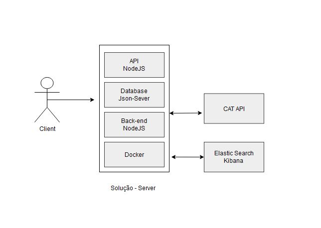
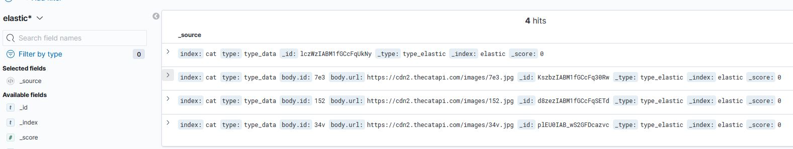
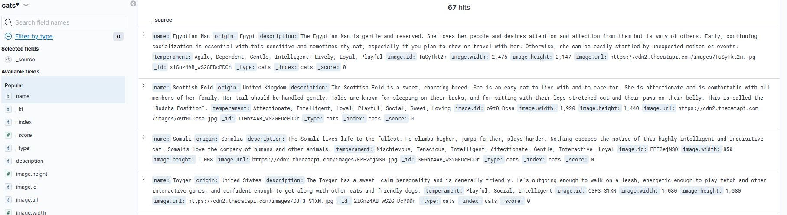

# Cat API Case

Essa solução recupera dados da API oficial: [Cats](https://thecatapi.com/).



> Recupera dados da API original e manipula eles. Arquitetura baseada em um sistema 'Cliente-Server', além de ser uma aplicação monolítica.

Documentação da API do projeto: [Docs](https://documenter.getpostman.com/view/21008445/Uyxkijry).

### Implementações futuras:

O projeto ainda está em desenvolvimento e as próximas atualizações serão voltadas nas seguintes tarefas:

- [ ] Observability - Kibana, Logs.
- [ ] API´s Dash - Prometheus.
- [ ] Implementação da fase de testes.

## Instalando

Para instalar, siga estas etapas:

Na raiz do projeto, realize o seguinte comando:
```
npm i
```
Na sequência, realize os seguintes comandos:
```
docker build -t api-case/ariel .
```
```
docker run -p 4004:4004 -d api-case/ariel
```

## ☕ Usando a aplicação:

Para usar, siga estas etapas:

Em um terminal, insira esses comandos:
```
docker-compose up -d --build
```
Após a inicialização:
```
npm start
```

Em um outro terminal, insira esse comando:
```
npm run start-db  ou  npm start-db
```

## Aplicação:

Endereço da Aplicação:
```
localhost:4004
```
Elastic Search - Kibana
```
localhost:5601
```




## Fase de Testes:

> Para os testes, o ideal para o ambiente da aplicação seria:

### Testes Estruturais:

- Testes Unitários: Por ser uma aplicação relativamente pequena e separada em algumas chamadas. Cada 'endpoint' será testado dessa forma.
- Teste de Stress: Cada chamada deve ser submetida a um teste de stress para averiguar chamadas inesperadas da documentação, quantidade de usuários e outros.
- Teste de Carga: Testar a quantidade de usuários simultâneos em um endpoint.
- Teste Automatizado: Simular e repetir diversos cenários de teste, para encontrar bugs, minimizar os problemas e diminuir o tempo gasto em testes manuais.

[⬆ Voltar ao topo](#Cat-API-Case)<br>